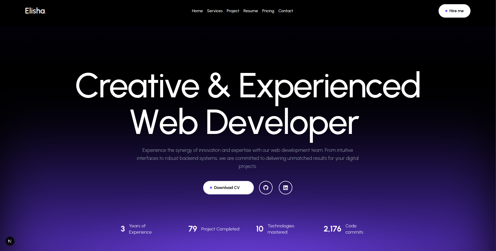

# 🌟 My Portfolio

Welcome to my personal portfolio! 🚀  
This is where I showcase my **projects, skills, and experience** as a developer. The goal of this portfolio is to highlight my journey, demonstrate what I’ve built, and share how I can bring value to real-world projects.

## 🔗 Live Demo

👉 [Visit Portfolio](https://your-portfolio-link.com)

---

## 🖼️ Preview

(Add a screenshot or gif of your portfolio here)  


---

## ⚡ Features

- 📱 **Responsive Design** – Works seamlessly across devices
- 🎨 **Modern UI/UX** – Clean, minimal and engaging
- 💼 **Projects Showcase** – My best work highlighted
- 🧑‍💻 **About Me Section** – Skills, tools, and journey
- 📬 **Contact Form** – Easy way to connect with me

---

## 🛠️ Tech Stack

- **Frontend:** React / Next.js / TailwindCSS / Framer Motion
- **Backend (if applicable):** Node.js / Express / MongoDB
- **Other Tools:** Git, Vercel, Figma, GSAP

---

## 🚀 Getting Started

If you’d like to run this portfolio locally:

```bash
# Clone the repo
git clone https://github.com/elishabhatti/elisha-portfolio.git

# Install dependencies
npm install

# Start the development server
npm run dev
```
